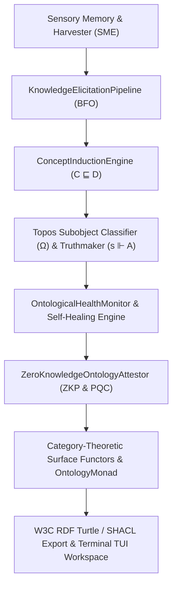

# Universal Ontological Operating System v2.0: Grand Master Architecture Specification

## 🏛️ Executive Summary & Vision

The **Neuro-Symbolic Ontological Operating System (Em-Cubed v2.0)** represents a unified framework integrating **axiomatic formal ontology**, **category theory**, **hyperintensional truthmaker semantics**, **description logic concept induction**, and **zero-knowledge cryptographic attestations** with **empirical sensory memory** (SME).

---

## 📐 Subsystem Architecture Overview (Phases 1 - 21)



---

## 🔬 Subsystem Specifications

### 1. Categorical Topos Engine & Subobject Classifier ($\Omega$)
- **Module**: `src/em_cubed/ontology/topos.py`
- **Theory**: Baclawski (Ontology Summit 2026). Replaces binary Boolean truth with Subobject Classifier ($\Omega$), evaluating continuous confidence degrees and modal truth operators (`NECESSARY`, `POSSIBLE`).

### 2. Kit Fine's Truthmaker Semantics Engine ($s \Vdash A$)
- **Module**: `src/em_cubed/ontology/truthmaker.py`
- **Theory**: Kit Fine (Ontology Summit 2025). Classifies exact truthmakers ($s \Vdash A$) and falsemakers ($s \Vdash_f A$), computing state fragment fusions ($s \sqcup t$) to isolate minimal relevant proof trails.

### 3. Description Logic Concept Induction ($C \sqsubseteq D$)
- **Module**: `src/em_cubed/ontology/concept_induction.py`
- **Theory**: Prof. Pascal Hitzler (Ontology Summit 2026). Induces Description Logic class expressions from empirical execution trajectories and aligns neural activations with formal ontology classes.

### 4. Derived Property Reducers & Palantir Advanced Ontology
- **Module**: `src/em_cubed/ontology/advanced_ontology.py`
- **Theory**: Palantir DevCon 5 (Landon Carter). Computes derived property reductions (`SUM`, `AVERAGE`, `COUNT`, `JOIN`) and manages object backlinks and interface implementations.

### 5. Dynamic Schema Evolution & Migration Engine
- **Module**: `src/em_cubed/ontology/schema_evolution.py`
- **Theory**: Manages schema versioning, forward/backward compatibility checks, and automated triple migration step chains.

### 6. 4D/5D Temporal-Spatial Timeline Engine
- **Module**: `src/em_cubed/ontology/temporal_spatial.py`
- **Theory**: Evaluates 4D temporal snapshot queries (`TimeInterval`) and 5D spatial proximity reasoners (`GeoLocation` via Haversine distance math).

### 7. W3C Standard Interoperability Engine
- **Module**: `src/em_cubed/ontology/interoperability.py`
- **Theory**: Serializes active triples to W3C RDF Turtle, generates SHACL shape constraints, and parses OWL Turtle schemas.

### 8. SME 🤝 Em-Cubed Dual-Engine Synergy Bridges
- **Modules**: `SME/gateway/em_cubed_bridge.py`, `SME/src/logic/textual_gradient.py`, `SME/gateway/mcp_server.py`, `SME/src/logic/audit_engine.py`, `SME/gateway/routers/system.py`
- **Theory**: Unites SME's empirical signal extraction with Em-Cubed's formal ontology across 5 core bridges (Harvester Ingestion, Guided $\nabla_{\text{text}}$ Prompts, Epistemic Trust $\to \Omega$, Merkle Truthmakers, and Health Guardrail API).

### 9. Autonomous Dual-Engine Swarm Orchestrator
- **Module**: `src/em_cubed/orchestration/dual_engine_swarm.py`
- **Theory**: Runs multi-agent swarm lifecycles combining sensory ingestion, concept-guided optimization, modal truth evaluation, health purges, and RDF export.

### 10. Real-Time Dynamic Event Stream Processor
- **Module**: `src/em_cubed/ontology/event_stream.py`
- **Theory**: Processes streaming semantic mutations (`ASSERT`, `RETRACT`, `MUTATE`) and evaluates reactive rules continuously.

### 11. Quantum-Resistant Zero-Knowledge Proof Ledger
- **Module**: `src/em_cubed/ontology/zk_attestation.py`
- **Theory**: Generates SHA-256 Merkle commitments and Dilithium/Falcon quantum-resistant signatures, allowing independent verification without raw data leakage.

### 12. Live Terminal Workspace TUI
- **Module**: `src/em_cubed/cli_tui.py`
- **Theory**: Terminal-native multi-panel ASCII dashboard rendering live triple ledgers, Topos $\Omega$ gauges, health coherence meters, and ZKP commitments.

### 13. Category-Theoretic Monadic Coprocessor & Surface Functors
- **Module**: `src/em_cubed/surfaces/functor.py`
- **Theory**: Surface Functors ($F: \mathcal{C} \to \mathcal{D}$) mapping structure between Python, Prolog, and Z3, with `OntologyMonad[T]` encapsulating state transformations.

---

## 🛠️ Complete CLI Command Reference

```bash
# Validate triple against ledger rules
em-cubed ontology validate --subject USO_001001 --predicate has_ingredient --object FolicAcid

# Elicit BFO ontology from prompt
em-cubed ontology elicit --domain-prompt "Pharmaceutical Logistics"

# Extract exact truthmakers
em-cubed ontology truthmaker --proposition "Ingredient Check" --predicates has_ingredient has_origin

# Induce Description Logic class expression
em-cubed ontology induce --subclass-name HighTrustAgent

# Generate HTML Knowledge Graph visualization
em-cubed ontology visualize --output-html graph.html

# Execute schema migration
em-cubed ontology migrate --from-pred old_predicate --to-pred new_predicate

# Export W3C Turtle or SHACL
em-cubed ontology export --format turtle --output ontology.ttl

# Generate Zero-Knowledge Proof commitment
em-cubed ontology prove --proposition "Compliance Check" --predicates has_origin

# Launch Live Terminal Workspace TUI
em-cubed ontology tui
```

---

## 🌐 Production REST API Endpoints

- `POST /api/v1/loopy/execute`: Execute loopy skill trajectory.
- `POST /api/v1/ontology/validate`: Validate triple state.
- `POST /api/v1/ontology/graph-rag`: Execute multi-hop Graph-Path RAG.
- `GET /api/v1/ontology/federated-status`: Query swarm node consensus.
- `GET /api/v1/ontology/health`: Query live Coherence Index & self-healing guardrails.
- `WS /ws/ontology/stream`: Real-time streaming event socket.
