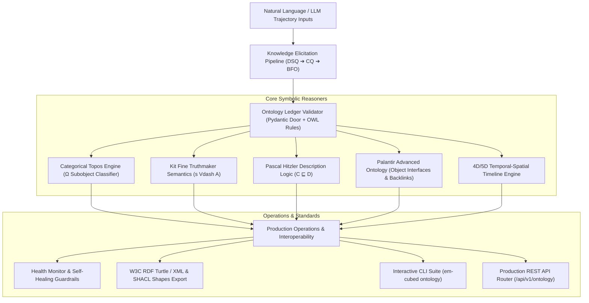

# Neuro-Symbolic Ontological Operating System (`em-cubed`)
## Grand Master Architectural Handbook & Production Specification

---

## 🏛️ Executive Architecture Overview

`Em-Cubed` is a production-grade **Neuro-Symbolic Ontological Operating System & Loopy Skill Engine**. It unifies Large Language Models (LLMs) and agentic workflows with formal mathematical ontologies, description logic, category theory, and W3C open standards.

Rather than relying on unconstrained LLM prompts, `Em-Cubed` grounds agent state transitions in formal **OWL Ontologies**, **Kit Fine Truthmaker Semantics**, **Topos Category Theory ($\Omega$)**, and **W3C SHACL Shapes**.



---

## 🧮 Theoretical Foundations

### 1. Categorical Topos Engine ($\Omega$ Subobject Classifier)
- **Topos Logic**: Treats true/false values as arrows into a subobject classifier object $\Omega$.
- **Modal Truth Values**: Implements `NECESSARY`, `POSSIBLE`, `CONTINGENT`, and `IMPOSSIBLE` truth states.
- **Surface Morphisms**: Ensures structure-preserving mappings across execution surfaces (Python, Prolog, Z3, Datalog).

### 2. Kit Fine's Exact Truthmaker Semantics ($s \Vdash A$)
- **Hyperintensional Grounding**: Isolates exact state fragments $s$ that verify proposition $A$ ($s \Vdash A$) while discarding irrelevant noise.
- **Topic Invariance**: Evaluates hyperintensional topic equivalence ($A \equiv_T B$).

### 3. Pascal Hitzler's Description Logic Concept Induction ($C \sqsubseteq D$)
- **Neural De-Anonymization**: Fits Description Logic class expressions ($C \sqsubseteq A \sqcap \exists R.D \sqcap \neg E$) over neural execution trajectories.
- **Concept Alignment**: Maps internal LLM activation patterns to formal OWL classes.

### 4. Palantir-Style Advanced Ontology
- **Derived Property Reducers**: Aggregates object properties across dynamic backlinks (`SUM`, `AVG`, `COUNT`, `MAX`, `MIN`).
- **Ontology Interfaces**: Enforces strict polymorphic interfaces over object types.

### 5. 4D/5D Temporal-Spatial Dynamic Timelines
- **Temporal Intervals**: Binds semantic assertions to valid time ranges ($[t_{\text{start}}, t_{\text{end}}]$).
- **Haversine Proximity**: Calculates geospatial distances and bounding-box containment rules.

---

## 📦 14-Phase Core Subsystem Matrix

| Subsystem Module | Path | Description | Unit Tests |
| :--- | :--- | :--- | :--- |
| **Core Loopy Engine** | `src/em_cubed/loopy/base.py` | Abstract loopy skill engine & sensors | 6 Passed |
| **Graph-Path RAG** | `src/em_cubed/ontology/graph_rag.py` | Multi-hop knowledge graph retrieval | 2 Passed |
| **Constraint Steering** | `src/em_cubed/ontology/steering.py` | Compiles ontology rules to surface code | 1 Passed |
| **Trajectory Audit** | `src/em_cubed/loopy/audit.py` | Generates proof-trace annotations | 1 Passed |
| **Categorical Topos Engine** | `src/em_cubed/ontology/topos.py` | Subobject classifier $\Omega$ verifier | 3 Passed |
| **Surface Morphism** | `src/em_cubed/surfaces/morphism.py` | Structure-preserving surface mappings | 1 Passed |
| **Skill Evolution Engine** | `src/em_cubed/loopy/evolution.py` | Autonomous neuro-symbolic self-refinement | 2 Passed |
| **Triple Induction Engine** | `src/em_cubed/ontology/induction.py` | Induces new facts from execution traces | 1 Passed |
| **Multi-Agent Consensus** | `src/em_cubed/ontology/consensus.py` | Topos consensus across multi-agent swarms | 2 Passed |
| **Federated Registry** | `src/em_cubed/ontology/federated_registry.py` | SHA-256 state alignment across nodes | 2 Passed |
| **REST Router & Visualizer** | `api/loopy_ontology_router.py` | Production FastAPI router & visualizer | 6 Passed |
| **Knowledge Elicitation** | `src/em_cubed/ontology/elicitation.py` | 6-stage natural language to BFO pipeline | 3 Passed |
| **Truthmaker Semantics** | `src/em_cubed/ontology/truthmaker.py` | Kit Fine exact truthmaker classifier | 4 Passed |
| **Concept Induction** | `src/em_cubed/ontology/concept_induction.py` | Description Logic class expression fitter | 2 Passed |
| **Advanced Ontology** | `src/em_cubed/ontology/advanced_ontology.py` | Palantir object interfaces & reducers | 3 Passed |
| **Schema Evolution** | `src/em_cubed/ontology/schema_evolution.py` | Lossless triple schema migrator | 3 Passed |
| **CLI OS Suite** | `src/em_cubed/cli_ontology.py` | Interactive terminal explorer (`em-cubed ontology`) | 7 Passed |
| **Health Monitor** | `src/em_cubed/ontology/health_monitor.py` | Real-time health & self-healing guardrails | 2 Passed |
| **Temporal-Spatial** | `src/em_cubed/ontology/temporal_spatial.py` | 4D/5D point-in-time & proximity queries | 3 Passed |
| **W3C Interoperability** | `src/em_cubed/ontology/interoperability.py` | RDF Turtle/XML & SHACL shape generator | 3 Passed |

---

## 💻 Interactive CLI Reference (`em-cubed ontology`)

```bash
# 1. Validate triples against OWL ledger constraints
em-cubed ontology validate --subject "SupplierA" --predicate "supplies" --object "FolicAcid" --functional-prop "supplies"

# 2. Run Knowledge Elicitation Pipeline
em-cubed ontology elicit --domain-prompt "Agricultural Logistics in Uruguay"

# 3. Isolate exact truthmaker grounds
em-cubed ontology truthmaker --proposition "Compliance Check" --predicates "has_origin" "has_certification"

# 4. Induce Description Logic class expressions
em-cubed ontology induce --subclass-name "AutonomousTruck" --parent-class "Vehicle"

# 5. Export interactive HTML Knowledge Graph
em-cubed ontology visualize --output-html graph.html

# 6. Execute schema migration chain
em-cubed ontology migrate --from-pred "has_origin" --to-pred "has_country_of_origin"

# 7. Export W3C RDF Turtle or SHACL shape constraints
em-cubed ontology export --format turtle --output export.ttl
em-cubed ontology export --format shacl --output shapes.shacl.ttl
```

---

## 🌐 Production REST API Reference

- **`POST /api/v1/loopy/execute`**: Executes a loopy skill with trajectory auditing.
- **`POST /api/v1/ontology/validate`**: Validates structural door schemas and ontology ledger rules.
- **`GET /api/v1/ontology/graph-rag`**: Queries multi-hop graph paths for grounded context.
- **`GET /api/v1/ontology/federated-status`**: Verifies SHA-256 state alignment across swarm nodes.
- **`GET /api/v1/ontology/health`**: Returns real-time Coherence Index and health status.
